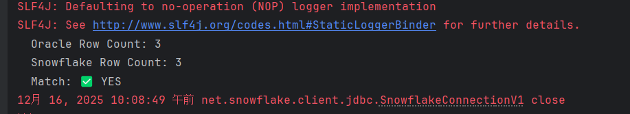
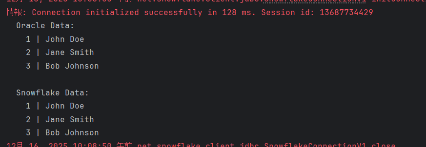
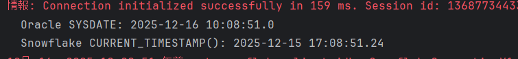

# Day 01 - 环境准备

## 培训学员

- 姓名：郑章乐
- 日期：2025-12-15

## 环境配置过程

### 1. Snowflake 账户配置

**配置步骤：**
1. 接收到 Snowflake 账户邀请邮件
2. 设置密码并启用 MFA（多因素认证）
3. 登录 Snowflake Web UI
4. 验证账户角色：`ACCOUNTADMIN`, `SYSADMIN`, `PUBLIC`

### 2. 开发工具安装

**已安装工具清单：**
- [x] IntelliJ IDEA 2024.1.1
- [x] Java 21
- [x] Git 2.43.0
- [x] Oracle SQL Developer 23.1
- [x] SnowSQL CLI 1.2.28

### 3. Git 工作流

**仓库克隆：**
```bash
git clone https://github.com/zhengzhangle5-jpg/migration-training.git
cd migration-training
git checkout -b feature/day01-environment
```

**提交规范测试：**
```bash
# 测试提交
echo "# Day 01 Setup" > README.md
git add README.md
git commit -m "docs: add day01 setup notes"
git push origin feature/day01-environment
```

**PR 提交检查：**
- [x] Commit message 符合规范（type: description）
- [x] 分支命名符合 `feature/{name}-{task}` 格式
- [x] PR 描述清晰，包含任务目标

### 4.  Oracle ↔ Snowflake 对比程序

**创建 `DatabaseComparisonTest.java`，同时连接 Oracle 和 Snowflake，对比查询结果：**

**运行结果对比：**
| 数据库 | Time Zone | Current Time |
|--------|---------|--------------|
| Snowflake | SYSDATE | 2025-12-16 10:08:51.0 |
| Oracle | CurrentTimeStamp() | 2025-12-15 17:08:51.24 |

**差异点：**
1. Oracle 使用 `CURRENT_TIMESTAMP()`，而Snowflake 使用 `SYSDATE`

**遇到的问题：**
- **问题1：** snowflake连接失败
    - **原因分析：** Snowflake JDBC 默认使用 Arrow 来高性能传输结果集，在底层会通过 反射访问 java.nio.Buffer.address，
      这与Java 9 以后引入「模块系统（JPMS）」产生冲突
    - **解决方案：** 添加VM option : --add-opens=java.base/java.nio=ALL-UNNAMED

- **问题2：** Oracle数据库连接失败，监听器不工作，但服务显示正常运行
    - **原因分析：** 当监听多个地址时，其中一个地址解析失败，整体就会失败
    - **解决方案：** 删除错误的地址

### 5. 结果对比

---

---

---

---

## 学习收获

1. 理解了 Snowflake 的角色层次结构（ACCOUNTADMIN > SYSADMIN > 自定义角色）
2. 掌握了基本的 SQL 差异（日期函数）
3. 熟悉了团队的 Git 工作流程
4. 理解了Oracle监听器服务的基本工作原理和常见连接错误的排查方法

