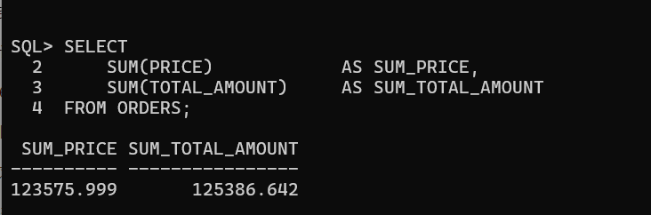
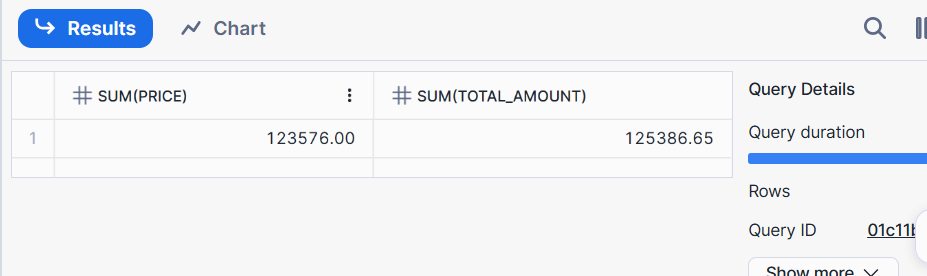
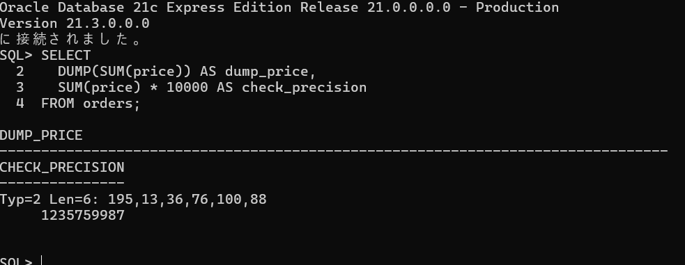
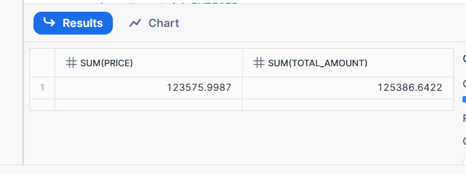

# Bug 修复报告 - 数据类型转换错误

## Bug 基本信息

- **Bug ID**: MIGRATION-2025-001
- **发现日期**: 2025-12-17
- **修复人**: 郑章乐
- **严重级别**: P1（数据准确性问题）
- **影响范围**: 订单金额计算模块

---

## 1. Bug 描述

### 1.1 现象

在迁移 `ORDERS` 表后，执行金额统计查询时发现：
- Oracle 中查询结果：`总金额 = 125386.642` (详情见‘oracle-amount.png’)
- Snowflake 中查询结果：`总金额 = 125386.65` (详情见‘snowflake-amount.png’)

**尽管金额相当接近，在系统中可能不会导致立刻奔溃，但账目永远对不上！**

### 1.2 复现步骤

```sql
-- Oracle 查询（正确）
SELECT
    SUM(PRICE),
    SUM(TOTAL_AMOUNT)
FROM ORDERS;
-- 结果（TOTAL_AMOUNT，下同）：125386.642

-- Snowflake 查询（错误）
SELECT
    SUM(PRICE),
    SUM(TOTAL_AMOUNT)
FROM ORDERS;
-- 结果：125386.65（小数部分错误）
```

---

## 2. 原因分析

### 2.1 数据类型定义对比

**Oracle 原始表结构：**
```sql
CREATE TABLE ORDERS (
    ORDER_ID        NUMBER(10)              NOT NULL,
    USER_ID         NUMBER(10)              NOT NULL,
    PRICE           NUMBER(10, 4)            NOT NULL,
    QUANTITY        NUMBER(5)               NOT NULL,
    TOTAL_AMOUNT    NUMBER(12, 4)            NOT NULL,
    ORDER_TIME      TIMESTAMP WITH LOCAL TIME ZONE NOT NULL,
    STATUS          VARCHAR2(20),
    CREATED_AT      DATE DEFAULT SYSDATE,
    CONSTRAINT PK_ORDERS PRIMARY KEY (ORDER_ID)
);
```

**Snowflake 迁移后表结构（错误版本）：**
```sql
CREATE OR REPLACE TABLE ORDERS (
    ORDER_ID        NUMBER(10, 0)        NOT NULL,
    USER_ID         NUMBER(10, 0)        NOT NULL,
    --错误！精度从4降到了2
    PRICE           NUMBER(10, 2)        NOT NULL,
    QUANTITY        NUMBER(5, 0)         NOT NULL,
    TOTAL_AMOUNT    NUMBER(12, 2)        NOT NULL,
    ORDER_TIME      TIMESTAMP_NTZ        NOT NULL,
    STATUS          VARCHAR(20),
    CREATED_AT      TIMESTAMP_NTZ,
    CONSTRAINT PK_ORDERS PRIMARY KEY (ORDER_ID)
);
```

### 2.2 根本原因

在 Snowflake 中：
- PRICE以及TOTAL_AMOUNT的精度被降到了两位
- 每一行数据在 INSERT 时被隐式四舍五入


### 2.3 错误传播路径

1. **DDL 生成工具错误**：自动化迁移工具将 `NUMBER(12, 4)` 简化为 `NUMBER(12, 2)`
2. **Code Review 遗漏**：PR 审查时未仔细检查数据类型定义
3. **测试数据不足**：初始测试数据都是整数，未发现小数丢失问题
4. **数据验证缺失**：未执行聚合函数对比验证

### 2.4 测试结果
---

---

---

## 3. 修复方案

### 3.1 修复 DDL

**正确的表结构：**
```sql
CREATE OR REPLACE TABLE ORDERS (
    ORDER_ID        NUMBER(10, 0)        NOT NULL,
    USER_ID         NUMBER(10, 0)        NOT NULL,
    PRICE           NUMBER(10, 4)        NOT NULL,
    QUANTITY        NUMBER(5, 0)         NOT NULL,
    TOTAL_AMOUNT    NUMBER(12, 4)        NOT NULL,
    ORDER_TIME      TIMESTAMP_NTZ        NOT NULL,
    STATUS          VARCHAR(20),
    CREATED_AT      TIMESTAMP_NTZ,
    CONSTRAINT PK_ORDERS PRIMARY KEY (ORDER_ID)
);
```

### 3.2 数据修复步骤

```sql
-- Step 1: 备份现有表
CREATE TABLE ORDERS_BACKUP AS SELECT * FROM ORDERS;

-- Step 2: 创建新表（正确的数据类型）
CREATE OR REPLACE TABLE ORDERS_NEW (
    ORDER_ID        NUMBER(10, 0)        NOT NULL,
    USER_ID         NUMBER(10, 0)        NOT NULL,
    PRICE           NUMBER(10, 4)        NOT NULL,
    QUANTITY        NUMBER(5, 0)         NOT NULL,
    TOTAL_AMOUNT    NUMBER(12, 4)        NOT NULL,
    ORDER_TIME      TIMESTAMP_NTZ        NOT NULL,
    STATUS          VARCHAR(20),
    CREATED_AT      TIMESTAMP_NTZ,
    CONSTRAINT PK_ORDERS PRIMARY KEY (ORDER_ID)
);

-- Step 3: 从 Oracle 重新导入数据
-- 执行Transmit.java程序

-- Step 4: 验证数据一致性
SELECT * FROM ORDERS;
SELECT * FROM ORDERS_NEW;

SELECT
    SUM(PRICE),
    SUM(TOTAL_AMOUNT)
FROM ORDERS;

SELECT
    SUM(PRICE),
    SUM(TOTAL_AMOUNT)
FROM ORDERS_NEW;


-- Step 5: 替换旧表
DROP TABLE ORDERS;
ALTER TABLE ORDERS_NEW RENAME TO ORDERS;
```

### 3.3 验证结果

**修复前后对比：**
| 指标 | 修复前 | 修复后 | Oracle 原始值 |
|------|--------|--------|---------------|
| 总金额 | 125386.65 | 125386.642 | 125386.6422 |

✅ **修复后数据与 Oracle 完全一致**
**这里小数点差了一位，是oracle客户端格式化的结果，详情可见oracle-correct.png的测试语句，可证明显示的结果隐藏了最后一位小数**

---

---

---

---

## 4. 预防措施

### 4.1 代码规范

**建议：强制指定 NUMBER 类型的精度和标度**

```sql
-- ❌ 禁止：省略精度
order_amount NUMBER

-- ✅ 推荐：明确指定
order_amount NUMBER(12, 4)

-- ✅ 也可以：整数类型明确标注
order_id NUMBER(10, 0)  -- 或使用 INTEGER
```

### 4.2 Code Review Checklist

在 PR Review 时必须检查：
- [ ] 所有 `NUMBER` 类型是否指定了精度和标度？
- [ ] 小数类型的标度是否与 Oracle 一致？
- [ ] 是否有金额、百分比等需要小数精度的字段？

---

## 5. 经验总结

### 5.1 关键学习点

1. **Snowflake 的 NUMBER 默认行为**
   - 不指定精度时默认为 `NUMBER(38, 0)`
   - 与 Oracle 不同（Oracle `NUMBER` 默认为 `NUMBER(38, 127)`）

2. **数据类型映射规则**
   - Oracle `NUMBER(p, s)` → Snowflake `NUMBER(p, s)`（保持一致）
   - Oracle `NUMBER` → Snowflake `NUMBER(38, 0)` 或 `FLOAT`（需根据实际情况选择）

3. **验证的重要性**
   - DDL 验证：检查表结构定义
   - 数据验证：检查数据准确性
   - 聚合验证：检查计算结果一致性

---

## 6. 相关文档

- [Snowflake NUMBER 类型文档](https://docs.snowflake.com/en/sql-reference/data-types-numeric.html#number)
- [Oracle NUMBER 类型文档](https://docs.oracle.com/en/database/oracle/oracle-database/19/sqlrf/Data-Types.html#GUID-A53B378A-D8B5-4BF0-8FFB-F3A11A0A68E5)
- 内部文档：`wiki/sql-conversion-guide/datatype-mapping.md`

---

**修复状态：** ✅ 已完成并通过验证
