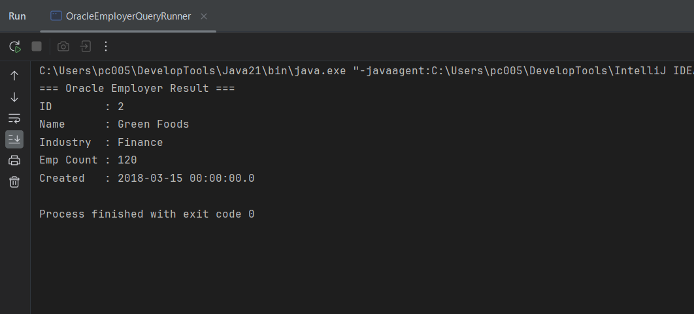
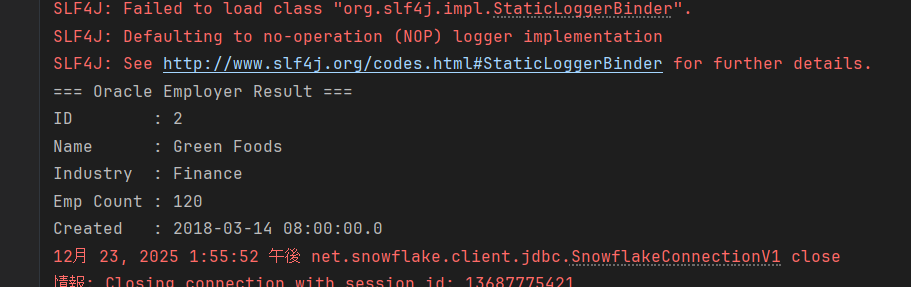
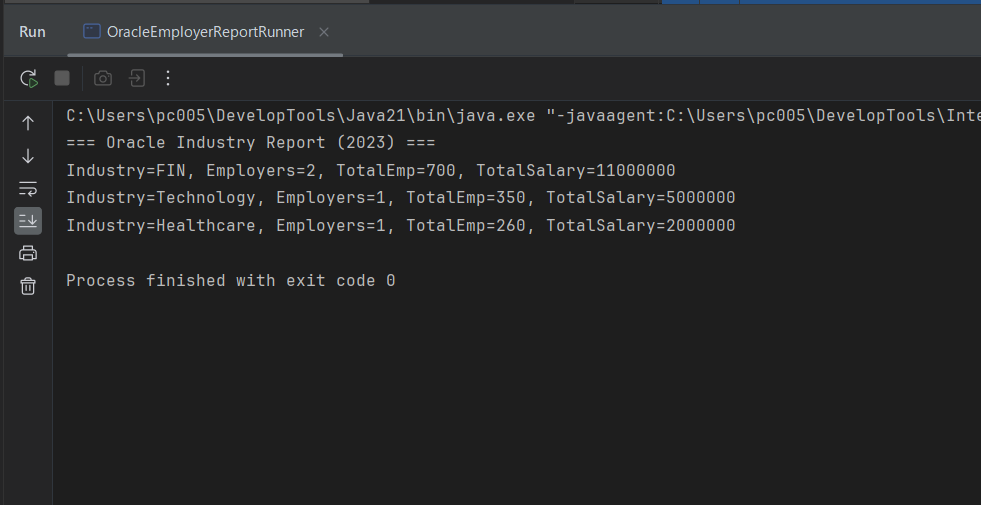
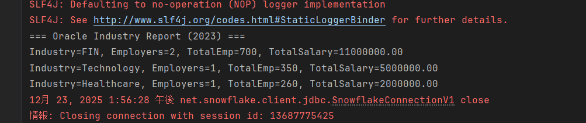

## 对比文档

## 1 业务信息

### 1.1 业务接口文件地址

**oracle接口1：简单查询**src/main/java/com/example/dao/oracle/EmployerDao.java

**oracle接口2：包含Join和聚合函数的复杂查询**src/main/java/com/example/dao/oracle/EmployerReportDao.java

**snowflake接口1：简单查询**src/main/java/com/example/dao/snowflake/EmployerDao.java

**snowflake接口2：包含Join和聚合函数的复杂查询**src/main/java/com/example/dao/snowflake/EmployerReportDao.java

### 1.2 转移难点分析

**在oracle的业务2特意使用了DECODE、NVL、隐式Join等oracle特有语法，并使用了CASE、COALESCE、JOIN标准ANSI写法进行了替换**

## 2 业务1：简单查询

### 2.1 oracle业务1源码

```java
String sql = """
            SELECT EMPLOYER_ID,
                   EMPLOYER_NAME,
                   INDUSTRY,
                   EMP_COUNT,
                   CREATED_DATE
            FROM EMPLOYERS
            WHERE EMPLOYER_ID = ?
        """;
```

### 2.2 snowflake业务1源码

```java
String sql = """
            SELECT EMPLOYER_ID,
                   EMPLOYER_NAME,
                   INDUSTRY,
                   EMP_COUNT,
                   CREATED_DATE
            FROM EMPLOYERS
            WHERE EMPLOYER_ID = ?
        """;
```

### 2.3 查询结果对比

---
oracle查询结果：

---
snowflake查询结果：

---

**结果分析：** 按照id的简单查询业务均正确无误

## 3 业务2:复杂查询

### 3.1 oracle混合查询sql语句
```java
//业务作用：按照公司类型分组并统计薪资总和
String sql = """
            SELECT
                /* Oracle 专用函数 DECODE，用于行业名称归一化 */
                DECODE(e.INDUSTRY,
                       'Finance', 'FIN',
                       'IT', 'TECH',
                       e.INDUSTRY) AS INDUSTRY,

                COUNT(e.EMPLOYER_ID) AS EMPLOYER_CNT,

                /* Oracle 专用函数 NVL，处理空值 */
                SUM(NVL(e.EMP_COUNT, 0)) AS TOTAL_EMP,

                SUM(NVL(s.TOTAL_SALARY, 0)) AS TOTAL_SALARY
            FROM EMPLOYERS e,
                 EMPLOYER_SALARY s
            WHERE e.EMPLOYER_ID = s.EMPLOYER_ID
              AND s.REPORT_YEAR = ?
            GROUP BY
                DECODE(e.INDUSTRY,
                       'Finance', 'FIN',
                       'IT', 'TECH',
                       e.INDUSTRY)
            ORDER BY TOTAL_SALARY DESC
        """;
```

### 3.2 snowflake混合查询sql语句
```java
//功能，该公司种类分组并查询工资总和，其中种类‘Finance’用‘Fin’代替
String sql = """
    SELECT
        /* from Oracle DECODE(...) -> Snowflake CASE WHEN */
        CASE
            WHEN e.INDUSTRY = 'Finance' THEN 'FIN'
            WHEN e.INDUSTRY = 'IT' THEN 'TECH'
            ELSE e.INDUSTRY
        END AS INDUSTRY,

        COUNT(e.EMPLOYER_ID) AS EMPLOYER_CNT,

        /* from Oracle NVL(e.EMP_COUNT, 0) */
        SUM(COALESCE(e.EMP_COUNT, 0)) AS TOTAL_EMP,

        /* from Oracle NVL(s.TOTAL_SALARY, 0) */
        SUM(COALESCE(s.TOTAL_SALARY, 0)) AS TOTAL_SALARY
            FROM EMPLOYERS e
            JOIN EMPLOYER_SALARY s
                ON e.EMPLOYER_ID = s.EMPLOYER_ID
            WHERE s.REPORT_YEAR = ?
            GROUP BY
        CASE
            WHEN e.INDUSTRY = 'Finance' THEN 'FIN'
            WHEN e.INDUSTRY = 'IT' THEN 'TECH'
            ELSE e.INDUSTRY
        END
    ORDER BY TOTAL_SALARY DESC
""";
```

### 3.3 执行结果对比分析

---
**oracle:**

---
**snowflake:**

---

**结果分析：** 两个数据库的业务均按照公司类型正确分组且正确统计出工资总和
