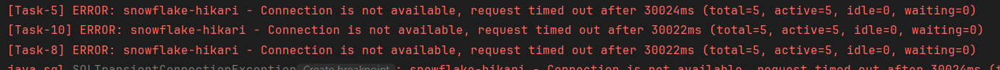
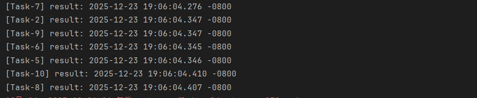
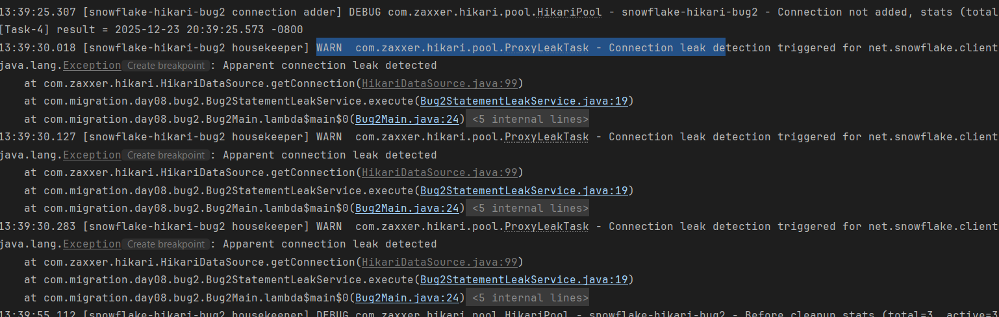
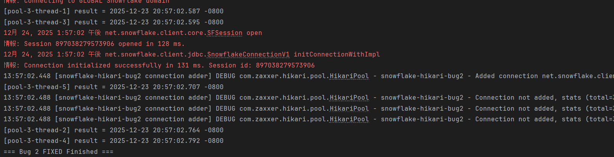
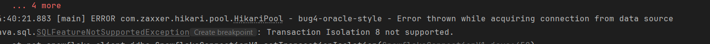
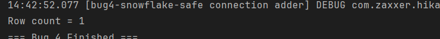
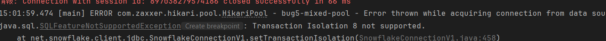
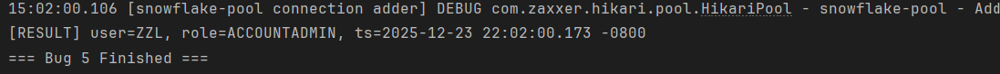

# JDBC 连接问题修复报告

## Bug 信息
- Bug ID: JDBC-2025-008
- 发现日期: 2025-12-24
- 修复人: 郑章乐
- 严重程度: P0（生产环境连接失败）

## 验证结果
- bug的完整运行结果在每部分的bug描述中给出
- 出错结果核心部分以bugX-origin.png形式列出
- 修改后的正确结果的核心部分以bugX-fixed.png形式列出

---

## 1. Bug1

### 1.1 bug描述

**现象：** snowflake执行10次连接时，半数连接失败

```
启动后同时提交 10 个并发任务请求 Snowflake 连接。

前 5 个任务成功获取连接并长期占用：
[Task-2] got connection
[Task-3] got connection
[Task-8] got connection
[Task-5] got connection
[Task-10] got connection

其余 5 个任务在 30 秒后获取连接失败，并相继抛出异常：
[Task-7] ERROR: snowflake-hikari - Connection is not available, request timed out after 30011ms (total=5, active=5, idle=0, waiting=0)
[Task-10] ERROR: snowflake-hikari - Connection is not available, request timed out after 30011ms (total=5, active=5, idle=0, waiting=0)
[Task-9] ERROR: snowflake-hikari - Connection is not available, request timed out after 30011ms (total=5, active=5, idle=0, waiting=0)
[Task-6] ERROR: snowflake-hikari - Connection is not available, request timed out after 30011ms (total=5, active=5, idle=0, waiting=0)
[Task-4] ERROR: snowflake-hikari - Connection is not available, request timed out after 30011ms (total=5, active=5, idle=0, waiting=0)

```
**图示：**


---

### 1.2 原因定位

#### 1.2.1 根本原因
- Snowflake JDBC 的连接池配置参数部分沿用了oracle的，导致不兼容

#### 1.2.2 源码定位
```配置问题
config.setMaximumPoolSize(5);        // 池子太小
config.setMinimumIdle(5);             // 和oracle一样保持过多的空闲连接，导致假活连接
config.setConnectionTimeout(30_000);  // 30s 超时，对于snowflake过短
config.setIdleTimeout(600_000);       // 空闲过长，连接可能被后端回收
config.setMaxLifetime(1_800_000);     // 生命周期过长，可能因云服务的不稳定导致僵尸连接
config.setLeakDetectionThreshold(0);  //故意关掉故障排查
```

```模拟业务阻塞，不关闭连接
Thread.sleep(60_000);
//conn.close();
```


---

### 1.3 解决方案

**正确的 Snowflake JDBC 配置：**
```SnowflakeDataSourceFactory
// === ✅ 修复后的 HikariCP 参数 ===
config.setPoolName("snowflake-hikari-safe");

config.setMaximumPoolSize(10);       // 合理并发上限
config.setMinimumIdle(1);            // 少量空闲
config.setConnectionTimeout(60_000); // 60s 等待
config.setIdleTimeout(120_000);      // 2 分钟释放
config.setMaxLifetime(900_000);      // 15 分钟重建

// ✅ 必须开启泄漏检测
config.setLeakDetectionThreshold(30_000);
```

**业务逻辑优化：**
```业务代码
// ✅ 业务耗时逻辑放在连接外
        doHeavyBusinessLogic(taskId);
    }

    private void doHeavyBusinessLogic(int taskId) {
        try {
            Thread.sleep(60_000);
            System.out.println(
                    "[Task-" + taskId + "] business done"
            );
        } catch (InterruptedException ignored) {
        }
    }
```

### 1.4 修改结果



---

---

## 2. Bug2

### 2.1 bug描述

**现象：** snowflake执行5次连接时，两个连接失败，与bug1情况极为相似

```关键日志部分：
WARN  com.zaxxer.hikari.pool.ProxyLeakTask - Connection leak detection triggered for n
```

**图示：**


---

### 2.2 原因定位

#### 2.2.1 根本原因
- 业务占用连接过长时间，导致连接耗尽

#### 2.2.2 源码定位
```业务堵塞（和bug1不同，最后会关闭连接）
Thread.sleep(60_000);

conn.close();
```

---

### 2.3 解决方案

**优化源码逻辑：**
```
删除‘Thread.sleep(60_000);’，组织连接被长时间占用
```

### 2.4 优化结果



---

---

## 3. Bug3

### 3.1 bug描述

**现象：** oracle风格的连接参数被自动忽略

```
```

---

### 3.2 原因定位

#### 3.2.1 根本原因
- Snowflake JDBC 会忽略不认识的参数

#### 3.2.2 源码定位
```配置问题
        // ===== Oracle ONLY 参数（在 Snowflake 中完全无效）=====
        props.setProperty("oracle.net.encryption_client", "REQUIRED");
        props.setProperty("oracle.net.crypto_checksum_client", "REQUIRED");
        props.setProperty("oracle.net.encryption_types_client", "(AES256)");
```

---

### 3.3 解决方案

**正确的 Snowflake JDBC 配置：**
```
// ===== Snowflake 正常参数 =====
        props.setProperty("user", "zzl");
        props.setProperty("password", "20030828zzlZzl");
        props.setProperty("db", "MIGRATION_TRAINING");
        props.setProperty("schema", "PRACTICE");
        props.setProperty("warehouse", "COMPUTE_WH");
        props.setProperty("role", "ACCOUNTADMIN");

        config.setDataSourceProperties(props);
```

---

---

## 4. Bug4

### 4.1 bug描述

**现象：** 运行时报错

```
14:45:59.599 [main] ERROR com.zaxxer.hikari.pool.HikariPool - bug4-oracle-style - Error thrown while acquiring connection from data source
java.sql.SQLFeatureNotSupportedException: Transaction Isolation 8 not supported.
```

**图示：**


---

### 4.2 原因定位

#### 4.2.1 根本原因
- Snowflake JDBC 明确不支持 TRANSACTION_SERIALIZABLE

#### 4.2.2 源码定位
```配置问题
        // ❌ Oracle 风格事务配置（在 Snowflake 中无意义）
        config.setAutoCommit(false);
        config.setTransactionIsolation("TRANSACTION_SERIALIZABLE");
```

---

### 4.3 解决方案

**正确的 Snowflake JDBC 配置：**
```
        // ✅ Snowflake 推荐方式
        config.setAutoCommit(true);
        // ❗ 不设置 transactionIsolation
```

### 4.4 优化结果



---

---

## 5. Bug5

### 5.1 bug描述

**现象：** 混用语句的查询失败

```
14:54:51.646 [main] ERROR com.zaxxer.hikari.pool.HikariPool - bug5-mixed-pool - Error thrown while acquiring connection from data source
java.sql.SQLFeatureNotSupportedException: Transaction Isolation 8 not supported.
```

**图示:**


---

### 5.2 原因定位

#### 5.2.1 根本原因
- snowflake不支持 TRANSACTION_SERIALIZABLE

#### 5.2.2 源码定位
```配置问题
// ❌ Oracle 风格事务配置（Snowflake 不支持）
        config.setAutoCommit(false);
        config.setTransactionIsolation("TRANSACTION_SERIALIZABLE");

        // ❌ Oracle 网络 / 安全参数（Snowflake 无效）
        Properties props = new Properties();
        props.put("user", "zzl");
        props.put("password", "20030828zzlZzl");
        props.put("db", "MIGRATION_TRAINING");
        props.put("schema", "PRACTICE");
        props.put("warehouse", "COMPUTE_WH");
        props.put("role", "ACCOUNTADMIN");

        // ❌ Oracle 专有参数
        props.put("oracle.net.encryption_client", "REQUIRED");
        props.put("oracle.net.crypto_checksum_client", "REQUIRED");
```

---

### 5.3 解决方案

**正确的 Snowflake JDBC 配置：**
```
 // ✅ Snowflake 推荐
        config.setAutoCommit(true);
        // ❌ 不设置 transactionIsolation

        Properties props = new Properties();
        props.put("user", "zzl");
        props.put("password", "20030828zzlZzl");
        props.put("db", "MIGRATION_TRAINING");
        props.put("schema", "PRACTICE");
        props.put("warehouse", "COMPUTE_WH");
        props.put("role", "ACCOUNTADMIN");

        // ✅ Snowflake 安全参数
        props.put("ssl", "on");
        props.put("ocspFailOpen", "false");
        props.put("CLIENT_SESSION_KEEP_ALIVE", "true");

        config.setDataSourceProperties(props);
```

### 5.4 优化结果



---

**交付日期**: 2025/12/24
