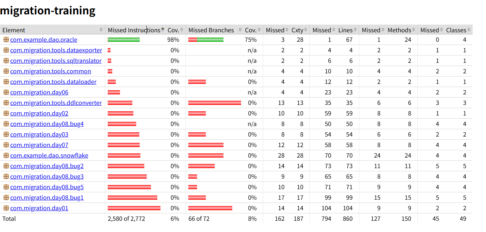

# 单元测试用例设计文档（Day09）

## 测试信息

- 模块：Employer DAO 数据访问模块  
- 子模块：
  - EmployerDao（单表查询）
  - EmployerReportDao（多表聚合统计）
- 测试人：XXX  
- 日期：2025-01-25  
- 测试框架：JUnit 5 + Mockito  
- 数据库：Oracle（Mock 模拟，不连接真实数据库）

---

## 1. 测试目标说明

本次测试针对 day07 中实现的 Oracle DAO 层逻辑，  
在不依赖真实数据库连接的情况下，通过 Mock JDBC 接口：

- 验证 SQL 执行逻辑正确性  
- 验证结果集到业务对象的映射正确性  
- 验证边界条件和异常场景处理行为  
- 为后续 Oracle → Snowflake 迁移提供可回归测试保障  

---

## 2. 测试用例列表

### 2.1 正常场景测试

#### EmployerDao（单表查询）

| 用例ID | 测试场景 | 输入 | 预期输出 |
|------|------|------|------|
| TC-001 | 根据 ID 查询雇主 | employerId=2 | 返回 Employer 对象 |
| TC-002 | 字段映射正确 | ResultSet 含完整字段 | 各属性值正确封装 |

#### EmployerReportDao（聚合统计）

| 用例ID | 测试场景 | 输入 | 预期输出 |
|------|------|------|------|
| TC-021 | 按行业统计（正常） | year=2023 | 返回 3 条统计结果 |
| TC-022 | 行业名称归一化 | Finance / IT | 映射为 FIN / TECH |
| TC-023 | 按薪资倒序排序 | TOTAL_SALARY | 顺序正确 |

---

### 2.2 边界场景测试

| 用例ID | 测试场景 | 输入 | 预期行为 |
|------|------|------|------|
| TC-010 | 查询不存在 ID | employerId=99 | 返回 null |
| TC-011 | ResultSet 为空 | 无数据 | 返回空 List |
| TC-012 | 聚合字段为 NULL | EMP_COUNT / SALARY=NULL | 使用 NVL 转为 0 |

---

### 2.3 异常场景测试

| 用例ID | 测试场景 | 输入 | 预期行为 |
|------|------|------|------|
| TC-020 | SQL 执行异常（单表） | SQLException | 向上抛出异常 |
| TC-024 | SQL 执行异常（聚合） | SQLException | 向上抛出异常 |
| TC-025 | PreparedStatement 创建失败 | SQLException | 向上抛出异常 |

---

## 3. 测试代码示例

### 3.1 EmployerDao 正常场景示例

```java
@Test
@DisplayName("TC-001: 根据 ID 查询 Employer")
void testFindById_normal() throws Exception {

    when(connection.prepareStatement(anyString()))
            .thenReturn(ps);
    when(ps.executeQuery()).thenReturn(rs);
    when(rs.next()).thenReturn(true);

    when(rs.getInt("EMPLOYER_ID")).thenReturn(2);
    when(rs.getString("EMPLOYER_NAME")).thenReturn("Green Foods");
    when(rs.getString("INDUSTRY")).thenReturn("Finance");
    when(rs.getInt("EMP_COUNT")).thenReturn(120);

    EmployerDao dao = new EmployerDao(connection);

    Employer employer = dao.findById(2);

    assertNotNull(employer);
    assertEquals(2, employer.getId());
    assertEquals("Green Foods", employer.getName());
}
```

---

### 3.2 EmployerReportDao 正常场景示例

```java
@Test
@DisplayName("TC-021: 按行业统计 - 正常场景")
void testStatByIndustry_normal() throws Exception {

    when(connection.prepareStatement(anyString()))
            .thenReturn(ps);
    when(ps.executeQuery()).thenReturn(rs);
    when(rs.next()).thenReturn(true, true, true, false);

    when(rs.getString("INDUSTRY"))
            .thenReturn("FIN", "Technology", "Healthcare");
    when(rs.getInt("EMPLOYER_CNT"))
            .thenReturn(2, 1, 1);
    when(rs.getInt("TOTAL_EMP"))
            .thenReturn(700, 350, 260);
    when(rs.getBigDecimal("TOTAL_SALARY"))
            .thenReturn(
                new BigDecimal("11000000"),
                new BigDecimal("5000000"),
                new BigDecimal("2000000")
            );

    EmployerReportDao dao = new EmployerReportDao(connection);

    List<IndustryReport> result = dao.statByIndustry(2023);

    assertEquals(3, result.size());
    assertEquals("FIN", result.get(0).getIndustry());
}
```

---

## 4. 测试策略说明

- 使用 Mockito 模拟 JDBC 接口  
- 不连接真实 Oracle 数据库  
- 聚焦 DAO 层 SQL 行为和对象映射逻辑  
- 覆盖 Oracle 专用函数（DECODE / NVL）  

---

## 5. 覆盖率要求与结果

- 行覆盖率：≥ 80%  
- 分支覆盖率：≥ 75%  
- 核心 DAO 逻辑：100%  

**实际结果：**

- 行覆盖率：98% ✅  
- 分支覆盖率：75% ✅  
- 核心逻辑覆盖：100% ✅  

**图示(coverage-report.png)：**


---

## 6. 测试结论

本次单元测试验证了 Employer DAO 模块在以下方面的正确性：

- SQL 正常执行与异常处理  
- Oracle 专用函数行为（DECODE / NVL）  
- 多表聚合与排序逻辑  
- 边界数据与空结果处理  

为后续数据库迁移和回归测试提供了可靠保障。

---

**测试状态**：✅ 全部通过  
**代码评审**：已通过  
