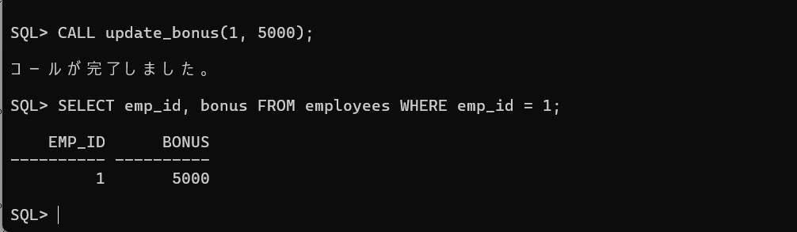
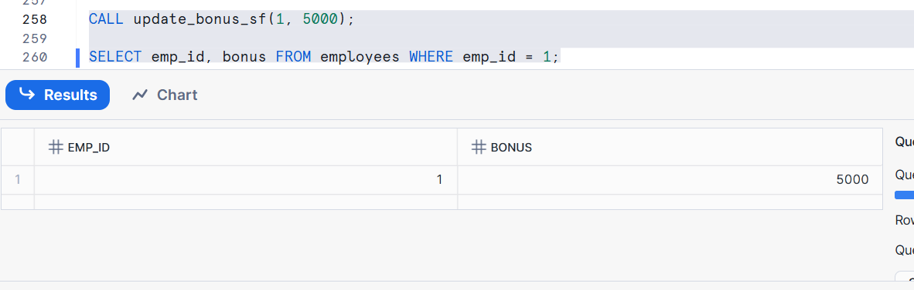
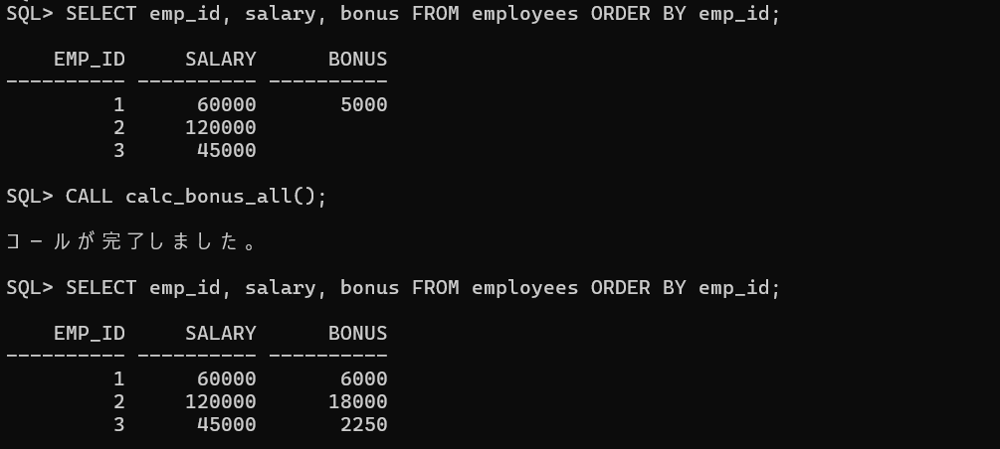
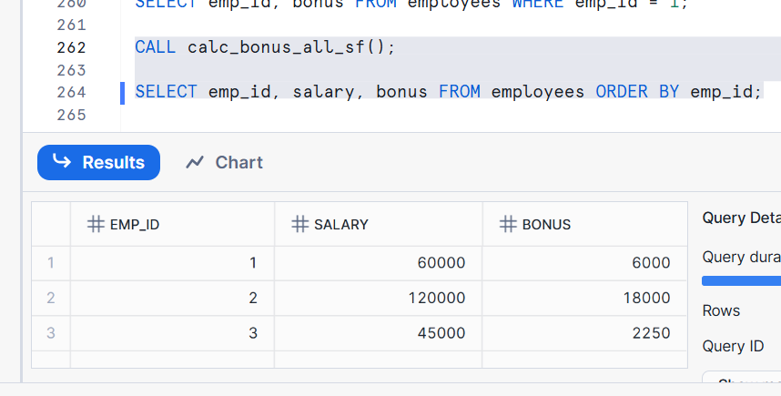
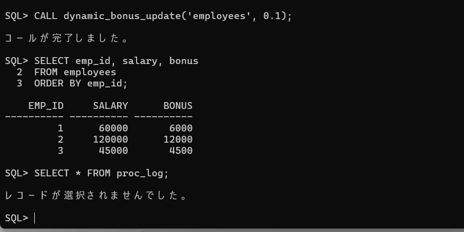
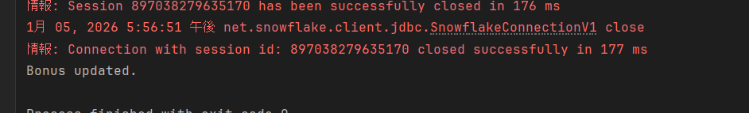
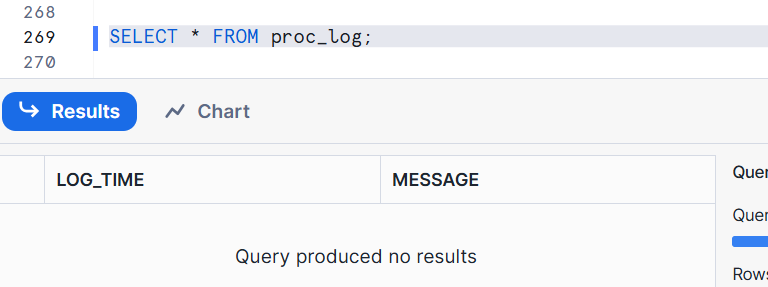
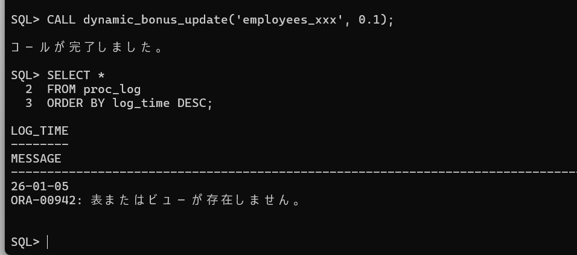
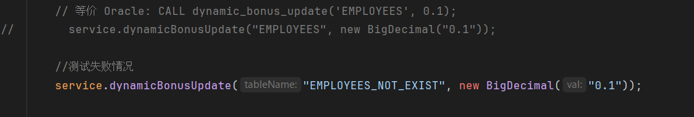
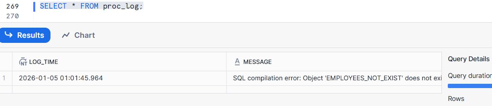

# 存储过程迁移方案说明

## 任务信息
- 学员：郑章乐
- 日期：2026-01-05
- 目标存储过程：`calculate_employee_bonus`

---

## 基本信息
- 操作表：
  - 员工表：employees
  - 日志表：proc_log（用于存储过程3）
- 业务逻辑：
  - SP1:根据 emp_id 更新员工 bonus
  - SP2:根据 salary 计算 bonus（salary > 100000 → 15%；salary > 50000 → 10%；其他 → 5%）
  - SP3:动态更新指定表的 bonus，并记录错误日志


## 1. SP1简单存储过程（参数传递 + 基本 CRUD）

### 1.1 Oracle 存储过程

```sql
CREATE OR REPLACE PROCEDURE update_bonus (
    p_emp_id IN NUMBER,
    p_bonus  IN NUMBER
) AS
BEGIN
    UPDATE employees
    SET bonus = p_bonus
    WHERE emp_id = p_emp_id;
END;
```

### 1.2 复杂度分析

| 特性     | 使用情况 | 迁移影响                   |
| ------ | ---- | ---------------------- |
| IN 参数  | 使用   | 语法基本兼容                 |
| OUT 参数 | 未使用  | 无需调整                   |
| 游标     | 未使用  | 无影响                    |
| 动态 SQL | 未使用  | 无影响                    |
| 异常处理   | 未使用  | 可选增强                   |
| 返回值    | 无    | Snowflake 中需显式 RETURNS |


**总体难度：** ⭐ 简单

---

### 1.3 可选方案

| 方案       | 描述                           | 适用性          | 结论    |
| -------- | ---------------------------- | ------------ | ----- |
| **方案 A** | Snowflake SQL Scripting 存储过程 | 语义最接近 Oracle | ✅ 推荐  |
| 方案 B     | JavaScript 存储过程              | 灵活但冗余        | ❌ 不必要 |
| 方案 C     | SQL 函数                       | 不支持 UPDATE   | ❌ 不可行 |


---

### 1.4 Snowflake 存储过程

```sql
CREATE OR REPLACE PROCEDURE update_bonus_sf(
    p_emp_id NUMBER,
    p_bonus  NUMBER
)
RETURNS STRING
LANGUAGE SQL
AS
$$
BEGIN
    UPDATE employees
    SET bonus = :p_bonus
    WHERE emp_id = :p_emp_id;

    RETURN 'SUCCESS';
END;
$$;

```

### 1.5 关键改动说明

| Oracle                               | Snowflake                  | 说明             |
| ------------------------------------ | -------------------------- | -------------- |
| `UPDATE ... WHERE emp_id = p_emp_id` | `WHERE emp_id = :p_emp_id` | ⚠️ 变量必须加冒号     |
| 无 RETURNS                            | `RETURNS STRING`           | Snowflake 强制要求 |
| 隐式成功                                 | `RETURN 'SUCCESS'`         | 明确返回结果         |


---

## 2. SP2：业务计算型存储过程（条件判断 + 计算逻辑）

### 2.1 Oracle 存储过程

```sql
CREATE OR REPLACE PROCEDURE calculate_bonus (
    p_emp_id IN NUMBER
) AS
    v_salary NUMBER;
    v_bonus  NUMBER;
BEGIN
    SELECT salary
    INTO v_salary
    FROM employees
    WHERE emp_id = p_emp_id;

    IF v_salary > 100000 THEN
        v_bonus := v_salary * 0.15;
    ELSIF v_salary > 50000 THEN
        v_bonus := v_salary * 0.10;
    ELSE
        v_bonus := v_salary * 0.05;
    END IF;

    UPDATE employees
    SET bonus = v_bonus
    WHERE emp_id = p_emp_id;
END;

```

### 2.2 复杂度分析

| 特性          | 使用情况       | 迁移影响       |
| ----------- | ---------- | ---------- |
| 条件判断        | IF / ELSIF | ELSEIF 需改写 |
| SELECT INTO | 使用         | 变量需加冒号     |
| UPDATE      | 使用         | 语法兼容       |
| 异常处理        | 未使用        | 可选增强       |

**总体难度：** ⭐⭐ 中等

---

### 2.3 可选方案

| 方案       | 描述                           | 适用性          | 结论    |
| -------- | ---------------------------- | ------------ |-------|
| **方案 A** | Snowflake SQL Scripting 存储过程 | 语义最接近 Oracle | ❌ 不可行 |
| 方案 B     | JavaScript 存储过程              | 灵活但冗余        | ✅ 推荐  |
| 方案 C     | SQL 函数                       | 不支持 UPDATE   | ❌ 不推荐 |


---

### 2.4 Snowflake 存储过程

```sql
CREATE OR REPLACE PROCEDURE calculate_bonus_sf(
    p_emp_id NUMBER
)
RETURNS STRING
LANGUAGE SQL
AS
$$
DECLARE
    v_salary NUMBER;
    v_bonus  NUMBER;
BEGIN
    SELECT salary
    INTO :v_salary
    FROM employees
    WHERE emp_id = :p_emp_id;

    IF (v_salary > 100000) THEN
        v_bonus := v_salary * 0.15;
    ELSEIF (v_salary > 50000) THEN
        v_bonus := v_salary * 0.10;
    ELSE
        v_bonus := v_salary * 0.05;
    END IF;

    UPDATE employees
    SET bonus = :v_bonus
    WHERE emp_id = :p_emp_id;

    RETURN 'SUCCESS';
END;
$$;

```

### 2.5 关键改动说明

| Oracle          | Snowflake        | 说明    |
| --------------- | ---------------- | ----- |
| `ELSIF`         | `ELSEIF`         | 关键字不同 |
| `INTO v_salary` | `INTO :v_salary` | 必须加冒号 |
| IF 无括号          | IF()             | 推荐写法  |

---

## SP3：动态 SQL + 异常处理 + 日志记录

### 3.1 Oracle 存储过程

```sql
CREATE OR REPLACE PROCEDURE dynamic_bonus_update (
    p_table_name IN VARCHAR2,
    p_rate       IN NUMBER
) AS
    v_sql     VARCHAR2(500);
    v_err_msg VARCHAR2(200);
BEGIN
    -- 构造动态 SQL
    v_sql := 'UPDATE ' || p_table_name ||
             ' SET bonus = salary * :1';

    -- 执行动态 SQL
    EXECUTE IMMEDIATE v_sql USING p_rate;

EXCEPTION
    WHEN OTHERS THEN
        v_err_msg := SQLERRM;

        INSERT INTO proc_log (log_time, message)
        VALUES (SYSDATE, v_err_msg);
END;
/

```

### 3.2 复杂度分析

| 特性     | 使用情况 | 迁移影响   |
| ------ | ---- | ------ |
| 动态 SQL | 使用   | 语法差异大  |
| 异常处理   | 使用   | 异常类型不同 |
| 日志表    | 使用   | 设计可复用  |


**总体难度：** ⭐⭐⭐ 偏高

---

### 3.3 可选方案

| 方案       | 描述                           | 适用性          | 结论    |
| -------- | ---------------------------- | ------------ |-------|
| **方案 A** | Snowflake SQL Scripting 存储过程 | 语义最接近 Oracle | ❌ 不可行 |
| 方案 B     | JavaScript 存储过程              | 灵活但冗余        | ❌ 不可行 |
| 方案 C     | SQL 函数                       | 不支持 UPDATE   | ✅ 推荐  |


---

### 3.4 Snowflake 存储过程

```java
public class BonusService {

  private final DataSource dataSource;

  public BonusService(DataSource dataSource) {
    this.dataSource = dataSource;
  }

  public void dynamicBonusUpdate(String tableName, BigDecimal rate) {

    String updateSql =
            "UPDATE " + tableName +
                    " SET bonus = salary * ?";

    try (Connection conn = dataSource.getConnection();
         PreparedStatement ps = conn.prepareStatement(updateSql)) {

      ps.setBigDecimal(1, rate);
      ps.executeUpdate();

    } catch (SQLException e) {
      logError(e.getMessage());
    }
  }

  private void logError(String errorMsg) {

    String logSql =
            "INSERT INTO proc_log (log_time, message) " +
                    "VALUES (CURRENT_TIMESTAMP(), ?)";

    try (Connection conn = dataSource.getConnection();
         PreparedStatement ps = conn.prepareStatement(logSql)) {

      ps.setString(1, errorMsg);
      ps.executeUpdate();

    } catch (SQLException ex) {
      // 实际项目中这里会打日志
      ex.printStackTrace();
    }
  }
}

```

### 3.5 关键改动说明

| Oracle                           | Snowflake             | 说明     |
| -------------------------------- | --------------------- | ------ |
| `EXECUTE IMMEDIATE ... USING :1` | `USING (?)`           | 占位符不同  |
| `SYSDATE`                        | `CURRENT_TIMESTAMP()` | 函数差异   |
| `WHEN OTHERS`                    | `STATEMENT_ERROR`     | 异常类型收敛 |

---

---

## 4. 测试方案

### 4.1 SP1测试

```sql
CALL update_bonus_sf(1, 5000);

SELECT emp_id, bonus FROM employees WHERE emp_id = 1;
```
### 4.2 SP2测试

```sql
CALL calc_bonus_all_sf();

SELECT emp_id, salary, bonus FROM employees ORDER BY emp_id;
```
### 4.3 SP3测试，正常情况

```java
// 等价 Oracle: CALL dynamic_bonus_update('EMPLOYEES', 0.1);
service.dynamicBonusUpdate("EMPLOYEES", new BigDecimal("0.1"));
```

```sql
SELECT emp_id, salary, bonus
FROM employees;

SELECT * FROM proc_log;
```

### 4.4 SP3测试，错误情况

```java
//测试失败情况
service.dynamicBonusUpdate("EMPLOYEES_NOT_EXIST", new BigDecimal("0.1"));
```

```sql
SELECT emp_id, salary, bonus
FROM employees;

SELECT * FROM proc_log;
```

## 5 对比结果验证

```sql
-- 在 Oracle 和 Snowflake 中运行相同测试数据
-- 对比结果是否一致
```

### 5.1 SP1结果对比分析
**oracle结果：**

**snowflake结果：**

**结论：**根据 emp_id 更新员工 bonus， id为1的记录的bonus字段均修改为5000，执行结果均无误
---

### 5.2 SP2结果对比分析
**oracle结果：**

**snowflake结果：**

**结论：** 根据 salary 计算 bonus（salary > 100000 → 15%；salary > 50000 → 10%；其他 → 5%）。

60000*10%=6000（√）
120000*15%=18000（√）
45000*5%=2250（√）

**以上，结果均正确无误**
---

### 5.3 SP3结果对比分析，正常情况
**oracle结果：**

**snowflake，java成功执行：**

**snowflake，bonus值修改结果：**

**snowflake，错误记录表查询结果：**

**结论：** 动态更新指定表的 bonus，并记录错误日志，使用正确语句，结果bonus被正确修改，且无错误记录
---

### 5.4 SP3结果对比分析，错误情况
**oracle结果：**

**snowflake，错误业务执行：**

**snowflake，查询结果：**

**结论：** 动态更新指定表的 bonus，并记录错误日志。使用错误业务语句，均成功记录错误记录。
---

---

**文档状态：** ✅ 测试阶段完成
**完成时间：** 2026-01-05
