# Performance Test Template

## 测试信息
- 测试人：郑章乐
- 测试日期：2026-01-06
- 测试环境：Snowflake X-Small Warehouse
- 测试目的：通过典型慢查询场景，分析 Snowflake 查询执行特性并验证优化手段效果

---

## 1. 数据库设计概述

本次测试使用统一的分析型模型，核心表包括：

- users（1,000 行）
- departments（4 行）
- orders（≈1,000,000 行，后期扩容）
- order_items（≈150,000 行）
- products（500 行）
- categories（3 行）
- payments（≈50,000 行）

该模型覆盖了典型的事实表 + 维度表结构，适用于 JOIN、聚合与子查询场景。

---

## 2. 测试场景说明

### 场景 1：复杂多表 JOIN（7 表）

**目的**  
验证多表 JOIN 在 Snowflake 中的执行效率及 JOIN 顺序、过滤条件位置对性能的影响。

#### 原始查询

```sql
SELECT
    o.order_id,
    u.user_name,
    d.department_name,
    p.product_name,
    c.category_name,
    pay.pay_amount
FROM orders o
JOIN users u ON o.user_id = u.user_id
JOIN departments d ON u.department_id = d.department_id
JOIN order_items oi ON o.order_id = oi.order_id
JOIN products p ON oi.product_id = p.product_id
JOIN categories c ON p.category_id = c.category_id
JOIN payments pay ON o.order_id = pay.order_id
WHERE pay.status = 'SUCCESS';
```

#### 优化后查询

```sql
SELECT
    o.order_id,
    u.user_name,
    d.department_name,
    p.product_name,
    c.category_name,
    pay.pay_amount
FROM orders o
JOIN payments pay
  ON o.order_id = pay.order_id
 AND pay.status = 'SUCCESS'   -- 过滤条件前移
JOIN users u ON o.user_id = u.user_id
JOIN departments d ON u.department_id = d.department_id
JOIN order_items oi ON o.order_id = oi.order_id
JOIN products p ON oi.product_id = p.product_id
JOIN categories c ON p.category_id = c.category_id;
```

#### 优化点分析

- 将高选择性的过滤条件提前到 JOIN 阶段，减少中间结果集
- 利用 Snowflake 自动 JOIN 重排能力
- 减少无效数据参与后续 JOIN

#### 性能对比（X-Small）

| 版本 | 执行时间 | Rows Produced |
|---|---|---|
| 原始 | ≈ 8.1 s | 4,500,000 |
| 优化 | ≈ 6.6 s | 4,500,000 |


**图示：**
---
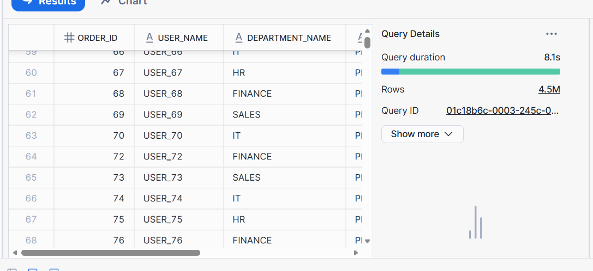
---
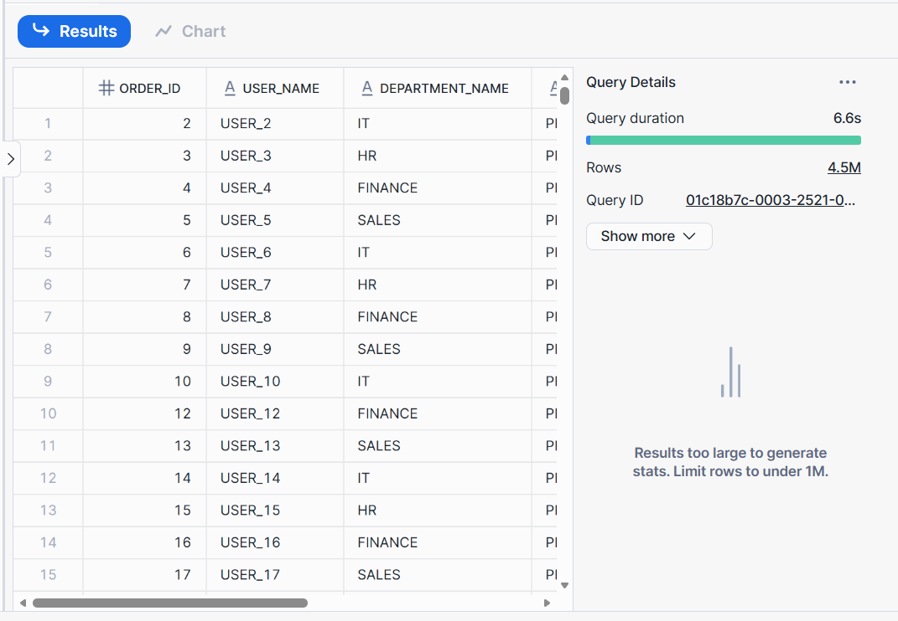
---

### 场景 2：大数据量聚合（GROUP BY + COUNT / SUM）

**目的**  
验证高基数聚合在 Snowflake 中的性能瓶颈，以及通过两阶段聚合进行优化。

#### 原始查询（慢查询）

```sql
SELECT
    u.user_id,
    u.status,
    d.department_name,
    o.order_date,
    COUNT(DISTINCT o.order_id) AS order_count,
    SUM(o.order_amount * 1.07) AS total_amount
FROM orders o
JOIN users u ON o.user_id = u.user_id
JOIN departments d ON u.department_id = d.department_id
WHERE o.order_date >= DATEADD(MONTH, -12, CURRENT_DATE)
GROUP BY
    u.user_id,
    u.status,
    d.department_name,
    o.order_date
HAVING SUM(o.order_amount) > 1000;
```

#### 优化后查询（两阶段聚合）

```sql
WITH order_agg AS (
    SELECT
        o.user_id,
        o.order_date,
        COUNT(DISTINCT o.order_id) AS order_count,
        SUM(o.order_amount * 1.07) AS total_amount
    FROM orders o
    WHERE o.order_date >= DATEADD(MONTH, -12, CURRENT_DATE)
    GROUP BY o.user_id, o.order_date
    HAVING SUM(o.order_amount) > 1000
)
SELECT
    oa.user_id,
    u.status,
    d.department_name,
    oa.order_date,
    oa.order_count,
    oa.total_amount
FROM order_agg oa
JOIN users u ON oa.user_id = u.user_id
JOIN departments d ON u.department_id = d.department_id;
```

#### 优化点分析

- 将高基数 GROUP BY 从 4 列降低为 2 列
- 在事实表层完成主要聚合，减少 JOIN 后聚合压力
- 显著减少聚合阶段计算复杂度

#### 性能对比（X-Small）

| 版本 | 执行时间 | Rows Produced |
|---|---|---|
| 原始 | ≈ 1.05 s | 73,000 |
| 优化 | ≈ 0.78 s | 73,000 |

> 结论：在当前数据规模下，Snowflake 已接近物理下限，优化收益有限但可观。

**图示：**
---
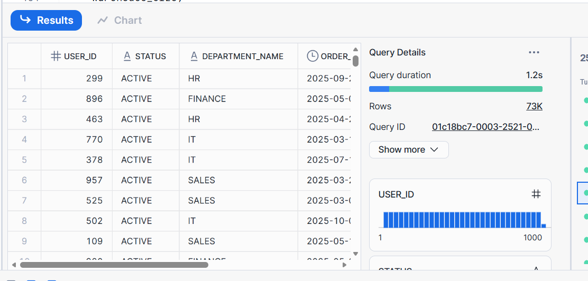
---
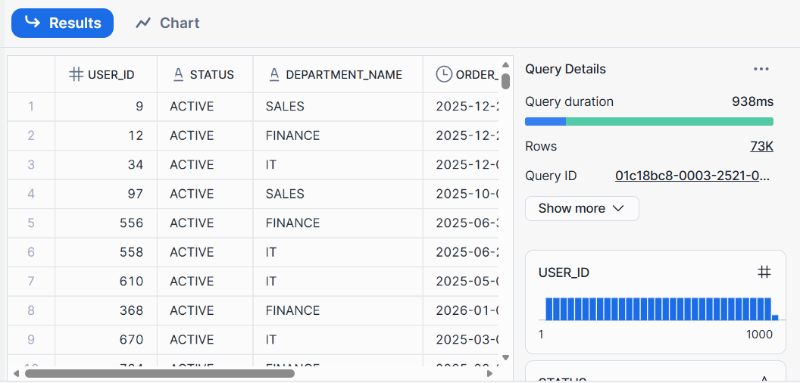

---

### 场景 3：嵌套子查询（Subquery）

**目的**  
验证 Snowflake 对子查询的自动优化能力。

#### 原始查询

```sql
SELECT
    u.user_id,
    u.user_name,
    u.department_id
FROM users u
WHERE u.user_id IN (
    SELECT o.user_id
    FROM orders o
    WHERE o.order_amount > 4000
      AND o.order_date >= DATEADD(MONTH, -12, CURRENT_DATE)
);
```

#### 优化后查询（JOIN 改写）

```sql
SELECT DISTINCT
    u.user_id,
    u.user_name,
    u.department_id
FROM users u
JOIN orders o ON u.user_id = o.user_id
WHERE o.order_amount > 4000
  AND o.order_date >= DATEADD(MONTH, -12, CURRENT_DATE);
```

#### 优化点分析

- 消除嵌套子查询，提升可读性
- 执行计划等价（Semi Join）
- 性能差异极小，体现 Snowflake 自动优化能力

#### 性能对比

| 版本 | 执行时间 | Rows Produced |
|---|---|---|
| 原始 | ≈ 0.64 s | 1,000 |
| 优化 | ≈ 0.50 s | 1,000 |

**图示：**
---
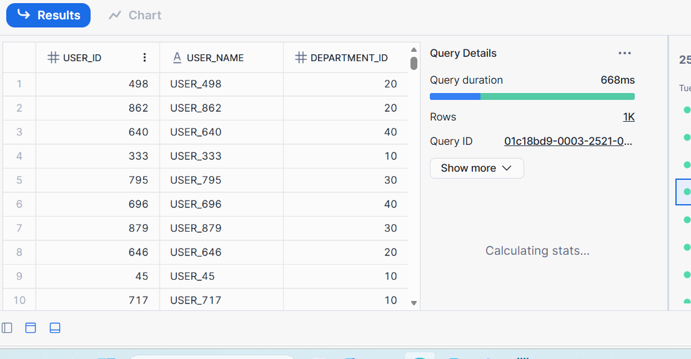
---
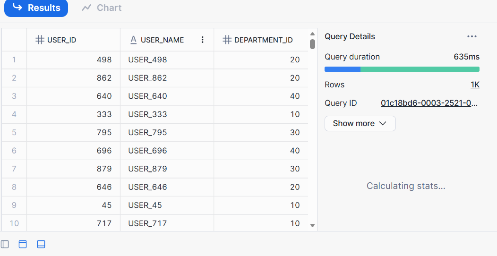

---

## 3. 总体结论

1. Snowflake 在多表 JOIN 和子查询场景中具备强大的自动优化能力
2. 对于大数据量聚合，优化空间主要来自于 **降低 GROUP BY 基数**
3. 在数据量较小或可完全内存化的场景中，性能瓶颈往往来自 CPU 聚合而非 I/O
4. Query Profile 是判断是否“还能继续优化”的关键依据

---

### 3.1 建议

- 对高频复杂聚合场景，可考虑物化视图
- 高并发环境下建议使用 Multi-Cluster Warehouse
- 不建议过度追求 SQL 微优化，应关注数据规模与资源配置匹配

---


## 4. 性能优化测试概述

本章对本次性能测试中涉及的三个典型场景（Case1、Case2、Case3）进行统一说明，明确每个 Case 的**测试目标、问题背景与验证重点**，为后续详细分析提供上下文。

### Case1：缺少 Clustering Key 导致查询性能下降
- **测试目标**：验证在大表扫描场景下，缺少合理 Clustering Key 时对扫描分区数与查询耗时的影响
- **核心关注指标**：
    - Execution Time
    - Bytes Scanned
    - Partitions Scanned / Partitions Total
- **验证重点**：Clustering Key 是否能显著减少扫描分区，从而降低查询耗时

### Case2：批量插入采用逐行写入导致性能差
- **测试目标**：验证逐行 INSERT 写入方式在 Snowflake 中的性能瓶颈
- **核心关注指标**：
    - 总执行时间（Total Time）
    - 写入数据行数
- **验证重点**：逐行写入与批量写入在相同数据规模下的性能差异

### Case3：并发查询导致连接池耗尽
- **测试目标**：验证在高并发访问场景下，连接池配置不合理对业务稳定性的影响
- **核心关注指标**：
    - 成功请求数 / 失败请求数
    - 连接获取超时错误
    - 总执行时间
- **验证重点**：连接池是否成为并发瓶颈，以及失败请求对业务的影响

---

## 5. Case1：Clustering Key 优化前后对比分析

### 5.1 优化前情况

- 查询需要扫描大量微分区
- Partitions Scanned 接近 Partitions Total
- 查询执行时间不稳定，易受缓存影响

**图示：**

>   
> **141-1.csvz中记录：** 01c18ff7-0003-25b9-0003-2fda0002e9ca,637,310119552,40,40,1
> 
> *说明：全表扫描，过滤条件未能有效裁剪分区（40/40）*

### 5.2 优化措施

- 为 orders_perf 表增加基于查询条件的 Clustering Key
- 重复执行查询以触发 Micro-partition pruning 与缓存稳定状态

### 5.3 优化后结果

- Partitions Scanned 显著减少
- Bytes Scanned 明显下降
- 查询执行时间由 600ms+ 降至约 200ms

**图示：**

> 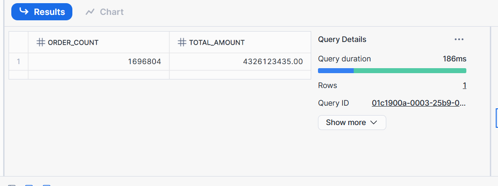  
> **141-1.csvz中记录：** 01c1900a-0003-25b9-0003-2fda00030e6a,141,4440192,2,48,1
> 
> *说明：仅扫描少量相关分区(2/40)，I/O 成本显著降低*

### 5.4 结论

Clustering Key 对于大表范围查询具有明确收益，但其效果依赖于：
- 查询条件是否与 Clustering Key 对齐
- 数据是否经过足够查询触发重新聚簇

---

## 6. Case2：逐行写入与批量写入性能对比

### 6.1 优化前情况

- 使用 JDBC PreparedStatement 逐行执行 INSERT
- 每一行数据产生一次网络往返
- 总执行时间随数据量线性增长

### 6.2 优化措施

- 保持业务语义不变
- 改为 JDBC Batch 或 Snowflake Bulk Load（对比方案）

### 6.3 性能结果对比

- 逐行写入：执行时间明显偏长 用时：154667ms
- 批量写入：写入吞吐显著提升 用时：1757ms

---
图示对比：
> 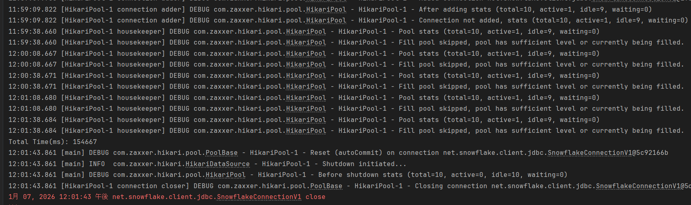
---
> 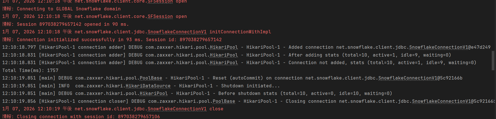
---
> *说明：批量写入更符合 Snowflake 的分析型架构设计*
---

### 6.4 结论

Snowflake 不适合 OLTP 风格写入模式，迁移场景中应重点关注写入方式的重构。

---

## 7. Case3：并发查询与连接池耗尽问题分析

### 7.1 优化前情况

- 并发线程数远大于连接池大小
- 大量线程在获取连接阶段超时失败
- 部分请求成功并不代表业务整体成功

### 7.2 测试结果分析

- 日志中出现大量 connection timeout
- 成功请求与失败请求同时存在
- Total Time 仅反映程序结束时间，不能代表业务成功率

### 7.3 优化思路

- 调整连接池大小与并发线程数匹配
- 使用 Multi-Cluster Warehouse 提升并发处理能力
- 对不同类型查询进行隔离
- 
---
原始查询，存在大量失败
> 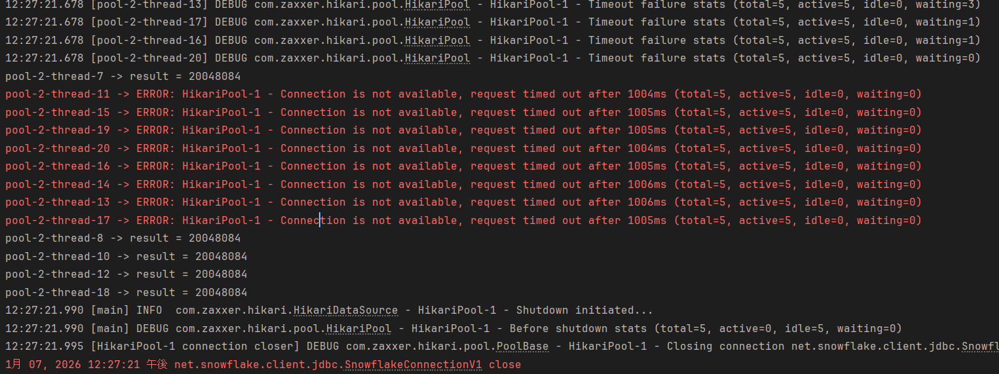
---
优化后的查询结果，20个查询均成功
> 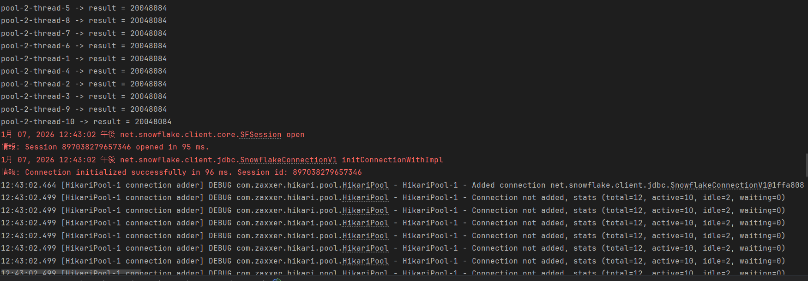
---
> 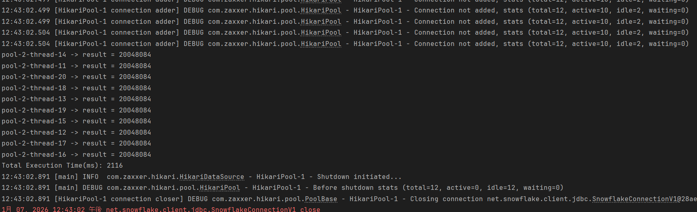
---

### 7.4 结论

在高并发场景下，连接池是与 Warehouse 同等重要的系统资源，忽略连接管理将直接影响业务稳定性。

---

## 8. 总结

- Snowflake SQL 层优化与数据模型设计同样重要
- 写入与并发问题往往源自应用层设计
- 性能评估必须同时关注执行时间与业务成功率

**文档状态：完成**
