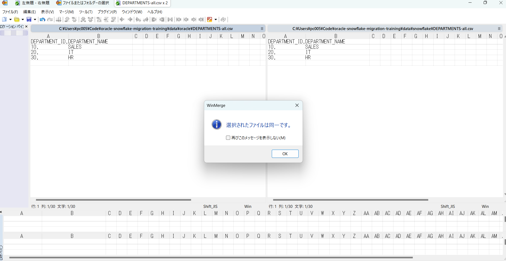
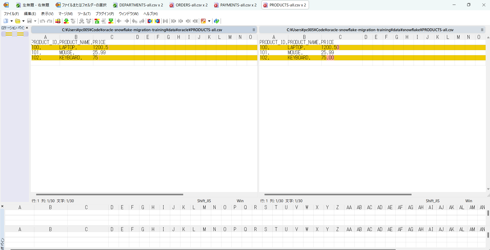

# Day14 数据验证报告（Oracle → Snowflake）

## 一、测试概述

### 1.1 测试目标

本次测试的目标是验证 Oracle 数据迁移至 Snowflake 后的数据一致性，通过自动化方式对迁移结果进行多层级校验，确保：

- 行数一致  
- 数据内容一致  
- 数据类型与精度符合预期  
- 可为后续批量迁移提供可复用的验证模式  

---

### 1.2 验证策略（Validation Levels）

本次验证覆盖以下 3 个层级（基于实际数据规模调整）：

| Level | 验证项 | 说明 |
|------|------|------|
| Level 1 | 行数验证 | 验证 Oracle 与 Snowflake 表记录数一致 |
| Level 2 | 列值校验 | 基于 CSV 内容进行列级聚合 / Hash 对比 |
| Level 4 | 全量对比 | 对小表进行逐行逐列全量一致性验证 |

说明：  
- 教程中的抽样对比（Level 3）因示例表仅包含少量数据，本次未单独执行  
- 所有验证均基于 CSV 原始数据文件，避免数据库函数差异干扰  

---

### 1.3 使用的工具与技术

#### 数据库
- Oracle 21c  
- Snowflake  

#### 核心工具类

| 工具类 | 作用 |
|------|------|
| OracleConnectionUtil | 获取 Oracle JDBC 连接 |
| SnowflakeConnectionUtil | 获取 Snowflake JDBC 连接 |
| CsvUtil | 将 ResultSet 导出为 CSV 文件 |
| OracleTableExportUtil | 导出 Oracle 表数据（DATE 仅保留日期） |
| SnowflakeTableExportUtil | 导出 Snowflake 表数据 |

#### 测试框架
- JUnit 5.10.0  
- Maven Surefire Plugin  

---

## 二、测试一：Level 1 行数验证

### 2.1 测试目标

验证同一张表在 Oracle 与 Snowflake 中的记录总数是否一致，用于快速发现数据遗漏或重复加载问题。

### 2.2 测试实现说明

- 数据来源：  
  - Oracle CSV：`data/oracle/{table}-all.csv`  
  - Snowflake CSV：`data/snowflake/{table}-all.csv`  

- 校验方式：  
  - 读取 CSV 文件  
  - 排除表头  
  - 统计行数并进行断言  

### 2.3 测试结果

✅ 行数一致，验证通过  

---

## 三、测试二：Level 2 列值 / 校验和验证

### 3.1 测试目标

通过聚合与校验和方式，快速判断数据整体是否一致，重点发现数值精度或类型异常问题。

### 3.2 测试实现说明

- 数值列：SUM 聚合  
- 字符列：拼接后计算 Hash  
- Oracle 与 Snowflake 结果进行对比  

### 3.3 特殊处理

- Oracle DATE 字段导出时统一格式为 `yyyy-MM-dd`  
- Snowflake 日期字段天然不包含时分秒  
- 避免日期格式导致的伪差异  

### 3.4 测试结果

✅ 校验和值一致，验证通过  

---

## 四、测试三：Level 4 全量数据对比

### 4.1 测试目标

针对小数据量表，进行逐行逐列对比，确保数据完全一致。

### 4.2 对比规则

- CSV 行数一致  
- 表头顺序一致  
- 每一行、每一列内容一致  
- NULL 统一使用字符串 `NULL`  

### 4.3 测试结果

✅ 全量数据一致，验证通过  

---

## 五、第三方工具验证

### 5.1 WinMerge

**下载链接：** https://sourceforge.net/projects/winmerge/

### 5.2 执行结果

---
**departments：**

---
**orders：**

---
**payments：**

---
**product：**

---
**users：**

---

### 5.3 结果分析

**存在个别数据，如75.00，1200.50，在从oracle中查询到的结果中小数点位的‘0’不予显示。语义相同，但表现形式上仍有差异。**

**除此之外，所有数据均对比正确**

## 六、总结与结论

### 6.1 验证结论

| 项目 | 结果 |
|------|------|
| 行数一致性 | ✅ 通过 |
| 列值一致性 | ✅ 通过 |
| 全量一致性 | ✅ 通过 |
| 日期格式规范 | ✅ 已统一 |

### 6.2 实践收获

1. CSV 是跨数据库验证的稳定中间层  
2. DATE / TIMESTAMP 是最容易产生伪差异的字段  
3. Level 1 + Level 2 可覆盖大部分问题  
4. Level 4 适合作为小表兜底验证  
5. 不同的对比方式之间对小数点位‘0’是否显示存在理解差异

### 6.3 后续改进建议

- 增加差异行 CSV 输出  
- 支持多表批量验证  
- 生成 HTML 验证报告并集成到 CI  
- 改进自定义的对比程序，参考WinMerge对格式严格要求

---

报告生成时间：2026-01-08  
验证人：郑章乐 
