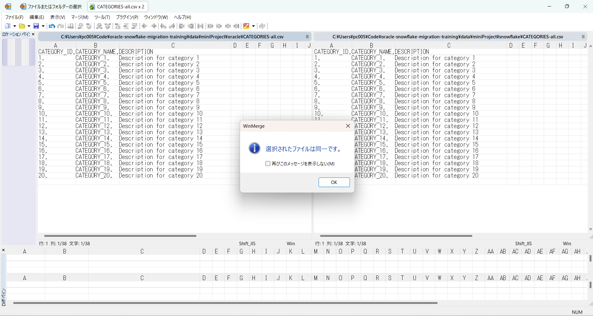
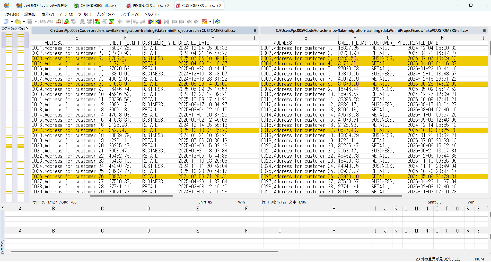
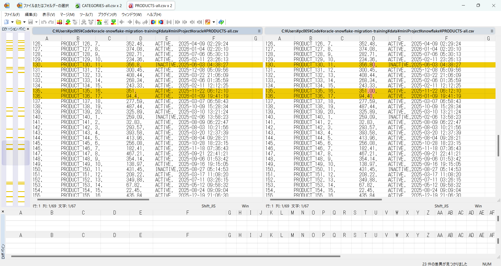
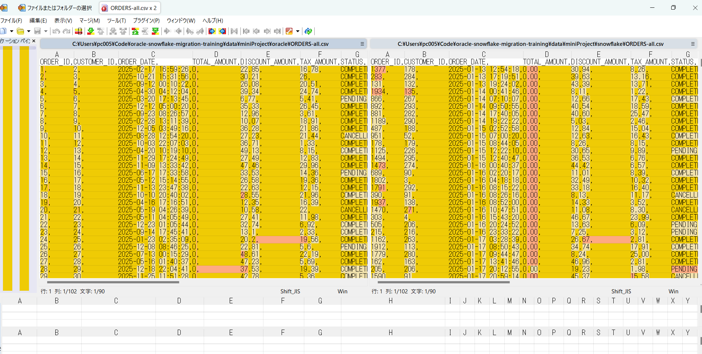
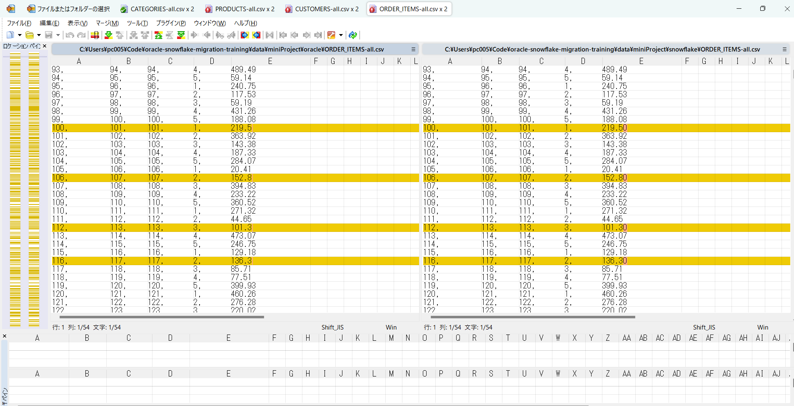

## 数据验证

## 1 csv文件存放位置

**oracle：** data/miniProject/oracle

**snowflake：** data/miniProject/snowflake

## 2 第三方工具校验

### 2.1 校验工具

**WinMerge**

### 2.2 CATEGORIES表数据校验

---

---
**结论：** 完全一致
---

### 2.3 CUSTOMERS表数据校验

---

---
**结论：** 两个数据库对小数点中的0采取不同显示策略，除该格式问题外其余完全一致
---

### 2.4 PRODUCTS表数据校验

---

---
**结论：** 格式问题同上，数据正确性上完全一致
---

### 2.5 ORDERS表数据校验

---

---

---
**结论：** snowflake中的数据呈现乱序，但仔细比较两条相同id的记录，结果是一致的，且记录数也相同。目前暂无有效方法去证明完全等价。
---

### 2.6 ORDER_ITEMS表数据校验

---

---
**结论：** 格式问题同上，数据正确性上完全一致
---

## 3 总结

**本次数据迁移工作已完成，且借助第三方工具初步验证了数据一致性。**

**关于ORDERS表顺序问题已在QA中提出**