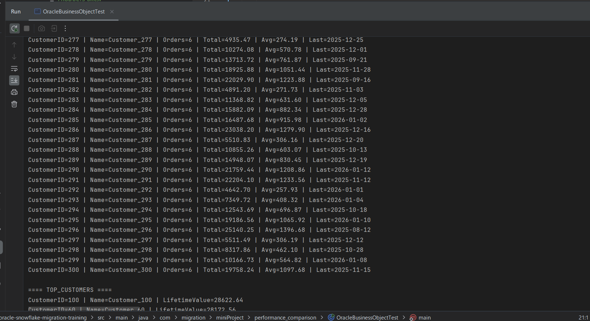
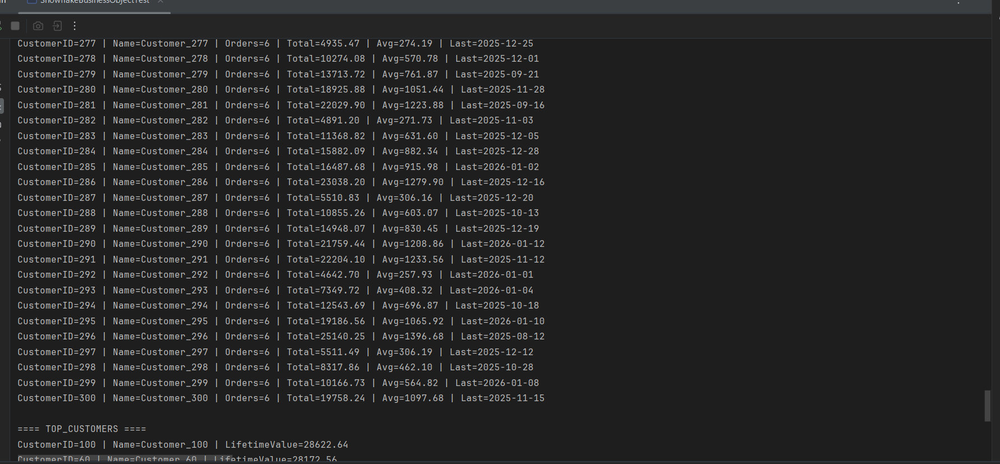
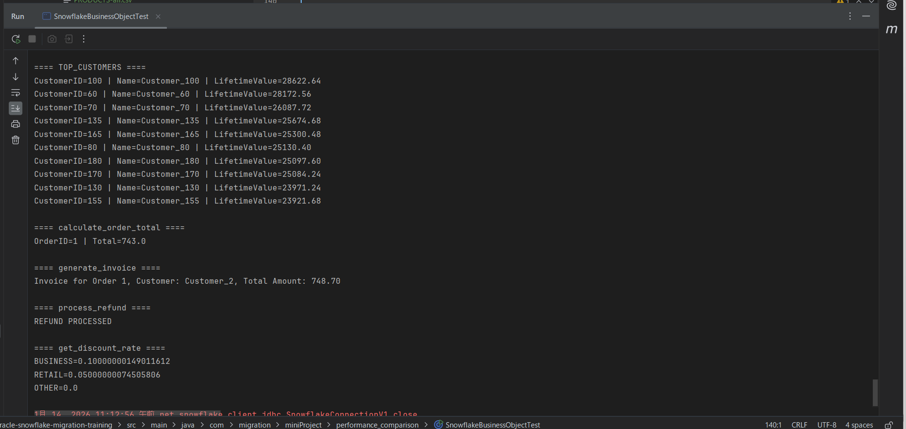

## 1 测试代码位置
**oracle：** src/main/java/com/migration/miniProject/performance_comparison/OracleBusinessObjectTest.java

**snowflake：** src/main/java/com/migration/miniProject/performance_comparison/SnowflakeBusinessObjectTest.java

## 2 结果比对

### 2.1 结果对比

---
>oracle:
> 

---

---
>snowflake:
>

---

**总结：** 迁移前后执行结果一致

### 2.2 功能说明

---
**CUSTOMER_ORDER_SUMMARY（视图）：**

功能：
+ 下过多少个订单（total_orders）
+ 累计消费金额（total_order_amount）
+ 平均每单金额（avg_order_amount）
+ 最近一次下单时间（last_order_date）

---
**TOP_CUSTOMERS（视图）：**

功能：
+ VIP 客户排行榜（消费金额 Top 10）

---

**calculate_order_total（存储过程）：**

功能：
+ 计算单个订单的最终金额

---

**process_refund（存储过程）：**

功能：
+ 处理订单退款

---
**generate_invoice（存储过程）：**

功能：
+ 生成订单发票文本
+ 根据订单号查客户名称并计算订单商品总额

---
**get_discount_rate（函数）：**

功能：
+ 根据客户类型返回折扣比例
+ BUSINESS 客户 → 10%

+ RETAIL 客户 → 5%

+ 其他类型 → 0%

---